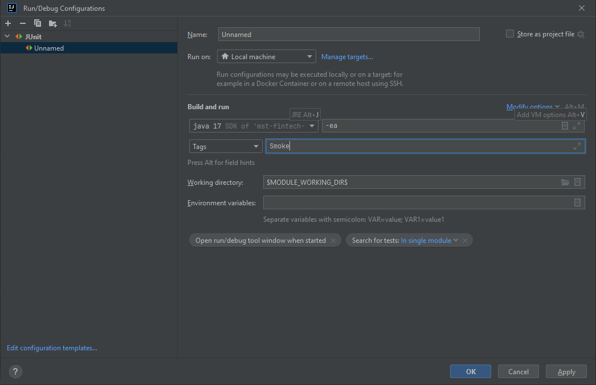

# MTS_Credit_App_Tests
MTS_Credit_App_Tests - это тесты для сервиса подачи заявок на кредит.

## Установка
- Развернуть PostgreSQL в соответствии с инструкцией разработчика (см. ниже "MTS_Credit_App").
- Создать базу данных с названием "MTS_Credit_App_TESTS" с пользователем "user" и паролем "1234".

## Запуск проекта
Запустить тестируемое приложение с профилем test нужно при помощи следующей команды:
```bash
mvn spring-boot:run -Dspring-boot.run.profiles=test
```
Данный профиль добавлен для того, чтобы запускать наше приложение в более подходящей для запуска тестов конфигурации (уменьшенное время для обработки статусов заявок).

## Параметризованные тесты
Используя junit аннотацию @ParameterizedTest написаны параметризованные тесты. Пример одно такого теста представлен ниже:
```
    @ParameterizedTest
    @EnumSource(names = {"CONSUMER", "BUSINESS"})
    void addOrder(TariffType tariffType) {
        CreateOrderSpec.createOrderSuccessful(tariffType, tariffMap, userCounter);
    }
```

## Настройка многопоточного запуска тестов
Для настройки многопоточного запуска тестов использованы следующие параметры конфигурации:
```
junit.jupiter.execution.parallel.enabled = true
junit.jupiter.execution.parallel.mode.default = concurrent
junit.jupiter.execution.parallel.mode.classes.default = same_thread
```
В данном проекте настроен последовательный запуск классов верхнего уровня и параллельный запуск их методов.

Также добавлены параметры конфигурации для записи выводов и ошибок:
```
junit.platform.output.capture.stdout = true
junit.platform.output.capture.stderr = true
```

## Создание Test Suites
При помощи аннотаций @Tag() и @Tags() созданы два тестовых набора: Smoke и Regress.
Примеры использования аннотаций:
```
    @Tags(value = {@Tag("Smoke"), @Tag("Regress")})
    @Test
    void getTariffs() throws IOException {
        GetTariffsSpec.assertMapEquals(GetTariffsSpec.getReferenceTariffsMap(), tariffMap);
    }
```
Для запуска тестового набора в IntelliJ IDEA настроены параметры Run/Edit Configurations (см. картинку):



# MTS_Credit_App
 MTS_Credit_App - это сервис, отвечающий за обработку кредитных заявок.

## Установка
Для развертки бд я использовал PostgreSQL. Поэтому перед тестированием необходимо:
- Зайти на официальный сайт PostgreSQL и загрузить установщик в соответсивии с вашей системой: https://www.enterprisedb.com/downloads/postgres-postgresql-downloads
- После установки, создайте пользователя с логином "user" и паролем: "1234". Далее для этого пользователя необходимо создать базу данных с названием "MTS_Credit_App"

## Как запустить проект

Необходимо написать следующие команды, находясь в директории проекта

```bash
mvn clean install

./mvnw package
java -jar target/credit-app-0.0.1-SNAPSHOT.jar 
```

## API
1. Получение тарифов
```
localhost:8080/loan-service/getTariffs
```
2. Подача заявки на кредит
```
localhost:8080/loan-service/order
```
http body (пример)
```
{
    "userId": 123456,
    "tariffId": 3
}
```
3. Получение статуса заявки
```
localhost:8080/loan-service/getStatusOrder?orderId=24f35741-df87-47fb-8bd6-b927a720018
```
4. Удаление заявки
```
localhost:8080/loan-service/deleteOrder
```
http body (пример)
```
{
    "userId": 123456,
    "orderId": "b12b25e9-f6be-4c28-9140-ed137bd1f630"
}
```
